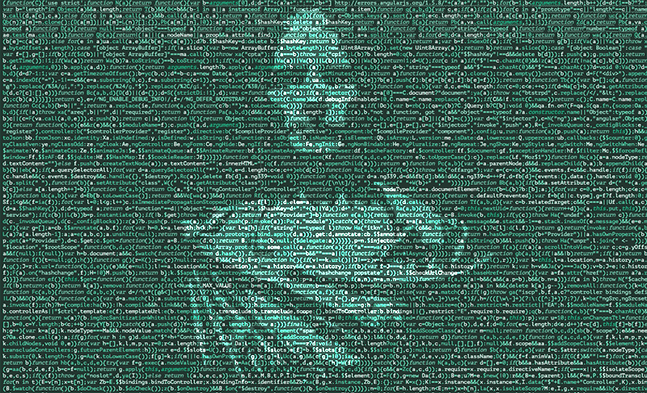

# markdown-project-template

*Template for a DH Project Using MarkDown and GitHub Pages*

---

[David J. Thomas](mailto::dave.a.base@gmail.com), [thePort.us](https://thePort.us)

---

*Put a caption to your image here, if you want*

---

## Project Template

This is a starter template for final projects. When you have completed your final project, you should replace this message (README.md) with a short 1-2 paragraph description of your project.

See the [Course Workbook Project Page](https://hacking-history.readthedocs.io/project) for more information on the final project.

**REQUIREMENTS BEFORE STARTING**
+ [GitHub account](https://github.com) created

---

## Past Project Examples

* [Confederate Memorials](http://confederate-memorials-project.readthedocs.io/)
* [The Slave Ledges](http://slave-ledger.readthedocs.io/en/latest/)
* [An Teanga Sean: The Celtic Languages](http://an-teanga-sean-the-celtic-languages.readthedocs.io/)

---
